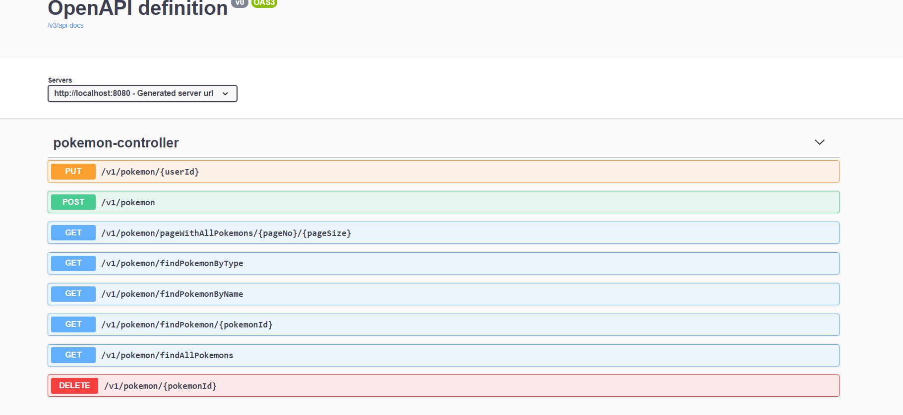
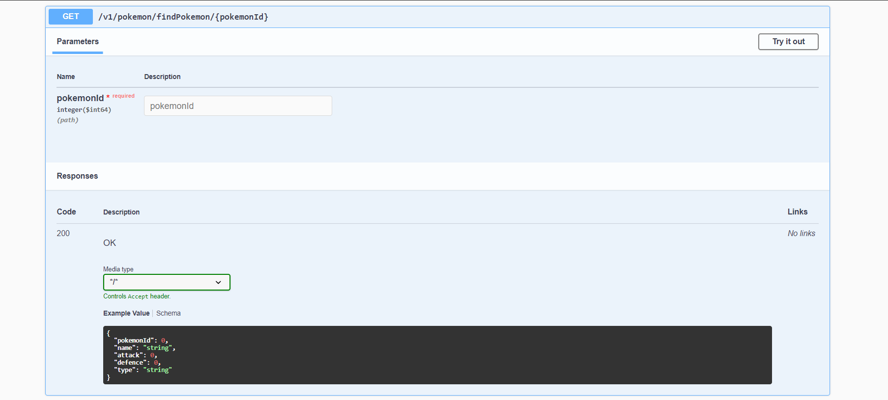
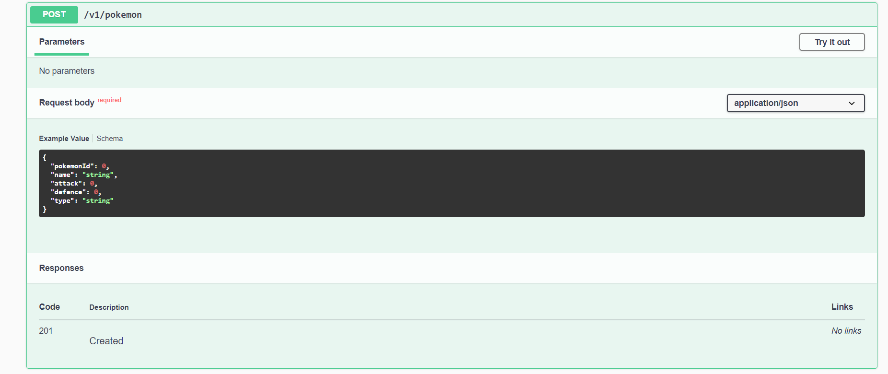
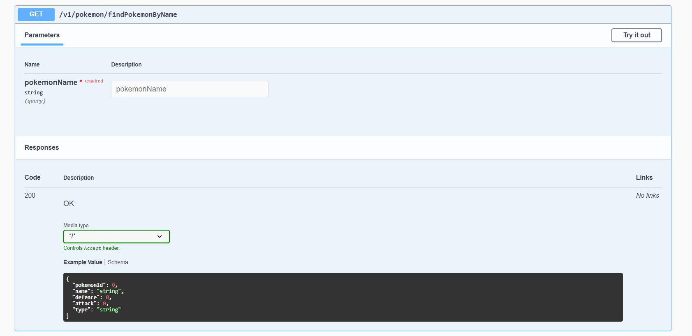
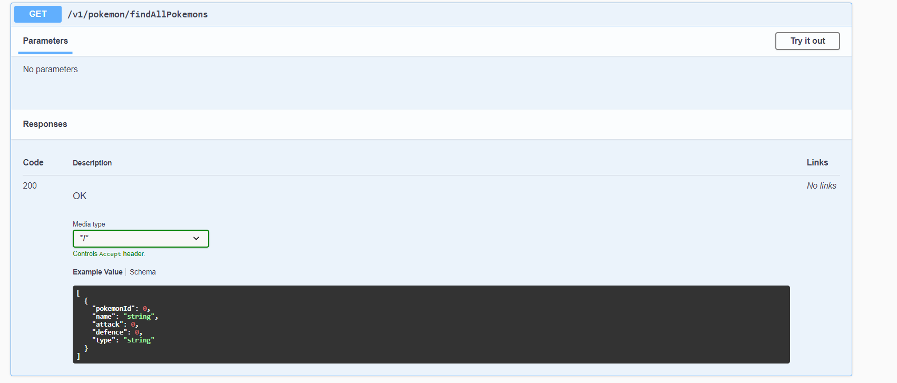
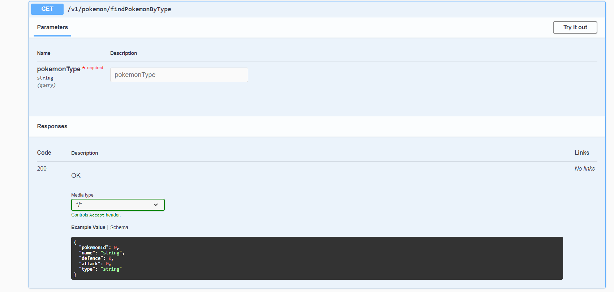
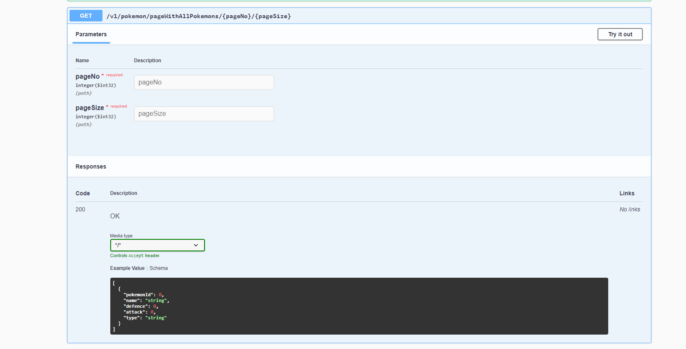
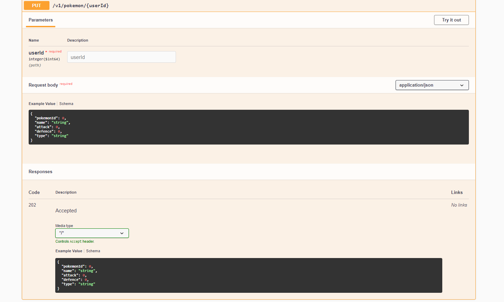

# 1. Description
It is a project that implements simple back-end logic. 
The purpose of the application is to allow the user to add, delete, update data about Pokemon. 
Just like in real Pokedex! The entire project was built using the REST architecture with pagination.
In project You can find one entity - Pokemon that uses SQL relationship.

The project also contains a file with a sample database insert query.

## Access data set in pplication.properties:
user: task_admin
password: admin

# 2. Demo

Project is only available at this repository at this moment.

# 3. Requirements

- Java 11
- Spring Boot 2.5.1
- MySQL 8
- Gradle 7.0
- Lombok 1.18.12
- Junit 5.4
- SpringDoc 1.5

# 4. Startup

Project can be launched locally by executing EcommerceeApplication class, which starts up the Spring ApplicationContext.
While on it can be accesed via [local address](http://localhost:8080).

# 5. Endpoints description

Endpoint documentation is available on a webpage, generated by project on this [URL](http://localhost:8080/swagger-ui/index.html?configUrl=/v3/api-docs/swagger-config#/).

|  |  |
:---:|:---:
 | 
 | 
 | 
 | 

# 6. Application

At this stage, project can operate with simple operations like:
- Create Pokemon,
- Update Pokemon (change fields like: name, attack, defence, type),
- Find Pokemon by ID, name or type,
- Find all Pokemons,
- Find with the use of pagination - the ability to set the page number (start from 0) and the number of displayed objects,
- Delete Pokemon by ID,

Future development:
- Security features